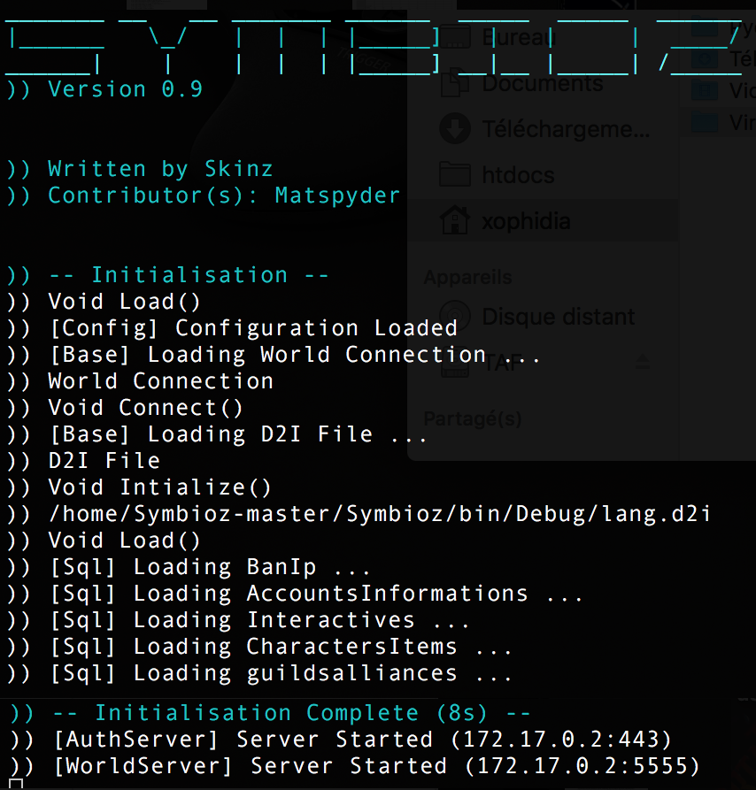

## Docker linux pour Symbioz ##

Symbioz est un émulateur dofus 2.30 écrit par Skinz3 [https://github.com/Skinz3/Symbioz](https://github.com/Skinz3/Symbioz) en C#.

### Installation ###

Clonez le dépôt dans le répertoire de votre choix puis tapez :

```
docker build .
```
Une fois l'installation finie, pour vérifier le bon fonctionnement 

Se connecter au docker 

```
docker run --rm -it Id
Id obtenu après avoir saisi docker images -a
exemple : docker run --rm -it d4676e2296be
root@5f8c3370cd5b:/#
```
puis 

```
mono /home/Symbioz/Symbioz/bin/Debug/Symbioz.exe
```

La base de donnée est automatiquement créée. Le compte test/test est crée par défaut mais si vous souhaitez en rajouter un :

```
mysql -e "insert into accounts values (2,"dofus","dofus","dofus",5,False,5,20,1,null);"
avec dans l'ordre nickname, login, password => dofus dofus dofus
```
ou

```
mysql
connect dofus
insert into accounts values (2,"dofus","dofus","dofus",5,False,5,20,1,null);
```


###Configuration ###

Le fichier config.xml présent dans le répertoire contenant symbioz.exe contient des éléments à modifier.

```xml
<Configuration>
  <CyclicSaveInterval>80</CyclicSaveInterval>
  <DatabaseHost>192.168.0.100</DatabaseHost>
  <DatabaseUser>root</DatabaseUser>
  <DatabasePassword></DatabasePassword>
  <DatabaseName>dofus</DatabaseName>
  <ServerId>31</ServerId>
  <AuthPort>443</AuthPort>
  <WorldPort>5555</WorldPort>
  <StartLevel>100</StartLevel>
  <StartMapId>54172969</StartMapId>
  <StartCellId>300</StartCellId>
  <DutyMapId>99091983</DutyMapId>
  <DutyCellId>300</DutyCellId>
  <StartKamas>0</StartKamas>
  <WelcomeMessage>SymbiozEmu version 0,9</WelcomeMessage>
  <ShowProtocolMessages>True</ShowProtocolMessages>
  <KamasDropRatio>1</KamasDropRatio>
  <ExperienceRatio>1</ExperienceRatio>
  <StartBankKamas>0</StartBankKamas>
  <Host>192.168.0.100</Host>
  <IsCustomHost>False</IsCustomHost>
  <RealHost />
  <SafeRun>False</SafeRun>
</Configuration>
```
### Utilisation ####

Se référer au lien du créateur de l'emulateur pour obtenir le client dofus permettant la connexion au docker.

Le docker automatise l'installation et le lancement du moteur.

Le fichier dofus_ID contient les id des items présent sur le jeu.


### [TODO] ###

 - ~~L'emulateur ne fonctionne pas "encore" car son code source doit être modifié pour prendre en compte l'arborescence de linux et eviter ce type d'erreur : (update dès que je trouve un windows !)~~

```
"/home/Symbioz/Symbioz/bin/Debug\lang.d2i"
```

Edit du 31/1 : Modification du fichier LangManager.cs

```
 public static void Intialize()
        {
            D2IFile = new D2IFile();
            // D2IFile.Open(Environment.CurrentDirectory + "\\lang.d2i");
            D2IFile.Open(Environment.CurrentDirectory + "/lang.d2i");
        }
``` 

 - ~~Modification du nom des tables de la bdd~~
	
 - Ajout des commandes permettant de lancer le docker avec une IP externe et lancement de l'émulateur.

#### Fonctionnement ####

Serveur : ok

</img>

Il ne reste qu'à connecter le client sur la bonne adresse IP et profitez du jeu.

###Avertissement ###

Si vous avez cette erreur lors de l'installation :

```
ERROR 2002 (HY000): Can't connect to local MySQL server through socket '/var/run/mysqld/mysqld.sock' (2)
```

```
connectez vous sur le docker et tapez
service mysql stop
service mysql start
puis relancez le script
/tmp/bdd
```
